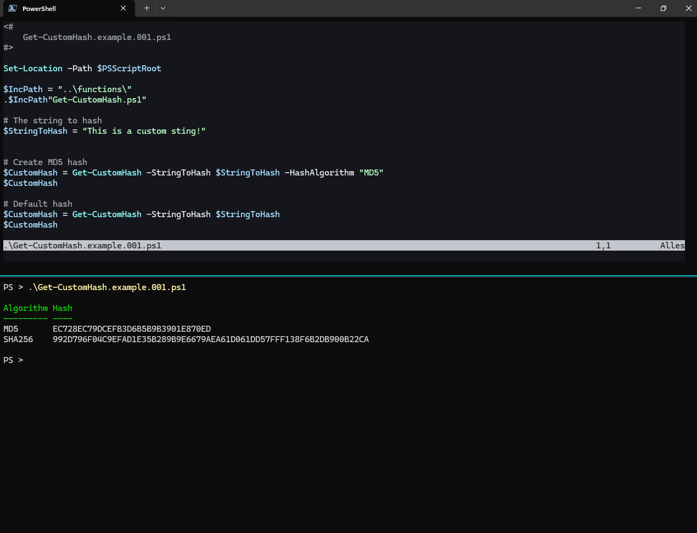

# PowerScriptCollection 

__A custom collection of powershell functions, scripts and code snippets.__  

I firmly believe that structured data can be incredibly useful, providing solutions and improvements for both personal and professional tasks. With just a few PowerShell functions, I have been able to achieve this efficiently.  

One of the key tools is [ConvertFrom-TextTable](#convert-texttable-to-object), which excels at transforming unstructured data into structured, machine-readable formats. Additionally, [Join-Objects](#join-powershell-objects) and [Rename-NoteProperty](#rename-noteproperty-of-objects) help me merge objects and standardize object properties, ensuring consistency.  

Perhaps the most __practical and effective__ function I’ve developed is [ConvertTo-MSSQL](#convert-objects-to-mssql) .  
It allows me to store all this valuable data in SQL databases, where the truly interesting data analysis begins.

---

## Overview

### Functions

[Convert Objects to MSSQL](#convert-objects-to-mssql)  
[Join PowerShell Objects](#join-powershell-objects)  
[Rename NoteProperty of Objects](#rename-noteproperty-of-objects)  
[Convert TextTable to Object](#convert-texttable-to-object)  
[Get Custom Credential](#get-custom-credential)  
[Get Custom Hash](#get-custom-hash)  
[Get Custom Password](#get-custom-password)  
[Convert Hex Columns to Decimal](#convert-hex-columns-to-decimal)  
[Compress File to Gzip](#compress-file-to-gzip)  
[Expand SqlTemplate](#expand-sqltemplate)  
[Get Custom SecretStore](#get-custom-secretstore)  

### Scripts

[WebDav File Downloader](#webdav-file-downloader)  

---

## Convert Objects to MSSQL

__A generic function for converting Powershell objects into MSSQL statements.__  
Convert a PowerShell object to microsoft structured query language. (MSSQL)  

See [documentation](docs/ConvertTo-MSSQL.md) for details.

### Screenshoots

## Join PowerShell Objects

__A simple function to join two PS objects based on an identic key.__  
The key must exists on both objects. After join returns the two objects as one.

### Screenshoots

## Rename NoteProperty of objects

__A function to rename one or multiple NoteProperty of objects.__

## Convert texttable to object

__Converts a text table into an array of PowerShell objects.__  

This function reads a formatted text table and extracts the data it contains
based on the defined start positions and lengths specified in a JSON string.
The function removes the specified header lines and returns a list of
PowerShell objects containing the extracted data.

See [documentation](docs/ConvertFrom-TextTable.md) for details.

### Screenshoots

## Get Custom Credential

__This function loads a credential, if it does not exist it is created.__

## Get Custom Hash

__This function creates a hash from string.__  
Simple helper, because PowerShell does not provide a cmdlet to compute the hash of a string.  
[https://learn.microsoft.com/en-us/powershell/module/microsoft.powershell.utility/get-filehash?view=powershell-7.4](https://learn.microsoft.com/en-us/powershell/module/microsoft.powershell.utility/get-filehash?view=powershell-7.4)

### Screenshoots

## Get Custom Password

__This function loads a custom password, if it does not exist it is created.__  
If commands do not support credentials, this function can be used to provide plain text passwords.  
The password is still only saved in encrypted form.

## Convert Hex Columns to Decimal

__Converts specified hex columns in a data array to decimal format.__
This function accepts an array of PowerShell objects and a list of column names containing hexadecimal values.  
It converts the specified hexadecimal columns to decimal format without modifying the original data.

---

## WebDav File Downloader

__Power Script Collection - WebDav File Downloader__  
Download images (jpg, png) from WebDav resource and store the images to a local directory

---

## Compress File to Gzip

__Compress file to gzip file__
Compresses a file in gizp in the same directory. Optionally, you can create the gzip file in a different directory.

---

## Expand SqlTemplate

__Loads a SQL file and replaces placeholders with variable values.__
This function reads a SQL template file and replaces placeholders of the form {{PLACEHOLDER}} with corresponding values from a hashtable provided via the -Variables parameter.

---

## Get Custom SecretStore

__Loads a custom configuration/secret object from CLIXML, or creates it if it does not exist. It can contain multiple fields/properties.__
Supports arbitrary fields (e.g., ApiUrl, ApiToken, Username, Password, Tenant, etc.).
Selected fields can be stored as SecureString (encrypted in CLIXML on Windows in the current user context).
This function is useful for storing tokens or other sensitive values, as well as general configuration data.