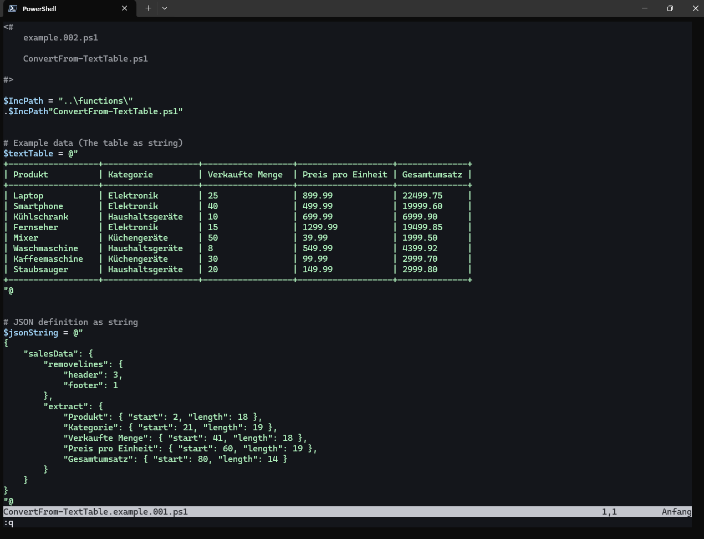

# PowerScriptCollection 

A custom collection of powershell functions, scripts and code snippets.  

---

## Overview

### Functions

[Convert Objects to MSSQL](#convert-objects-to-mssql)  
[Join PowerShell Objects](#join-powershell-objects)  
[Rename NoteProperty of Objects](#rename-noteproperty-of-objects)  
[Convert TextTable to Object](#convert-texttable-to-object)  
[Get Custom Credential](#get-custom-credential)  
[Get Custom Hash](#get-custom-hash)  
[Get Custom Password](#get-custom-password)  

### Scripts

[WebDav File Downloader](#webdav-file-downloader)  

---

## Convert Objects to MSSQL

__A generic function for converting Powershell objects into MSSQL statements.__  
Convert a PowerShell object to microsoft structured query language. (MSSQL)  

See [documentation](docs/ConvertTo-MSSQL.md) for details.

### Screenshoots

## Join PowerShell Objects

__A simple function to join two PS objects based on an identic key.__  
The key must exists on both objects. After join returns the two objects as one.

## Rename NoteProperty of objects

__A function to rename one or multiple NoteProperty of objects.__

## Convert texttable to object

__Converts a text table into an array of PowerShell objects.__  

This function reads a formatted text table and extracts the data it contains
based on the defined start positions and lengths specified in a JSON string.
The function removes the specified header lines and returns a list of
PowerShell objects containing the extracted data.

See [documentation](docs/ConvertFrom-TextTable.md) for details.

### Screenshoots

## Get Custom Credential

__This function loads a credential, if it does not exist it is created.__

## Get Custom Hash

__This function create a hash from string.__  
Simple helper, because PowerShell does not provide a cmdlet to compute the hash of a string.  
[https://learn.microsoft.com/en-us/powershell/module/microsoft.powershell.utility/get-filehash?view=powershell-7.4](https://learn.microsoft.com/en-us/powershell/module/microsoft.powershell.utility/get-filehash?view=powershell-7.4)

## Get Custom Password

__This function loads a custom password, if it does not exist it is created.__  
If commands do not support credentials, this function can be used to provide plain text passwords.  
The password is still only saved in encrypted form.

---

## WebDav File Downloader

__Power Script Collection - WebDav File Downloader__  
Download images (jpg, png) from WebDav resource and store the images to a local directory